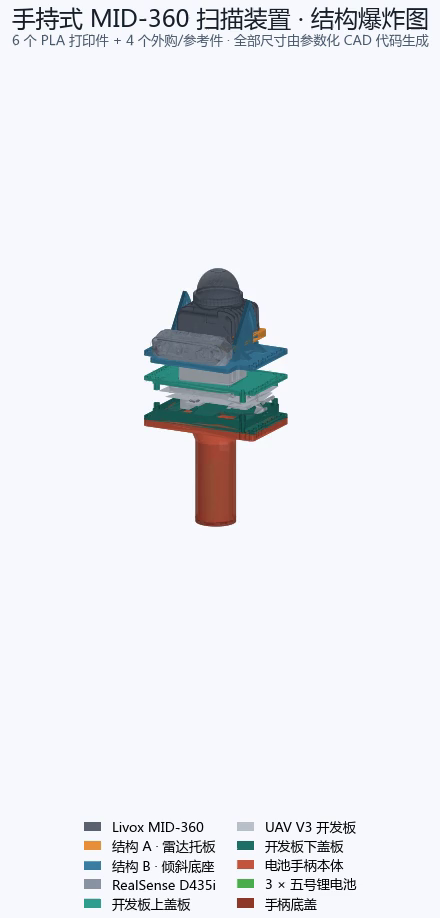

# 手持式 MID-360 扫描装置 · 参数化结构件



上图为早期电池手柄方案的视频首帧，供理解装配关系；尚未反映后续护壁、热熔螺母孔和站立手柄的变化。当前尺寸以源码参数和下文说明为准。

本项目为 Livox MID-360 激光雷达、RealSense D435i 和 UAV V3 开发板提供 PLA 打印结构件。
几何由 Python + FreeCAD 生成，包含雷达倾斜支架、开发板上下盖板，以及两种可替换的手柄。
尺寸单位均为 **mm**；传感器、开发板、电池包和金属紧固件属于外购件或参考模型。

## 结构件与 STEP 文件

四个共用件配合一种手柄使用：**站立手柄方案共 5 个打印件；电池手柄方案共 6 个打印件**。
当前共有 7 种独立打印件，上盖板的两个方向文件是同一结构的打印摆放方案，不增加零件数量。

| 结构件 | STEP 文件 | 当前主要尺寸或用途 |
|---|---|---|
| 结构 A · 雷达活动托板 | [part_a_radar_plate.step](step/part_a_radar_plate.step) | 69 × 85 × 6 平板，侧面安装 M3 热熔螺母 |
| 结构 B · 倾斜底座 | [part_b_tilt_base.step](step/part_b_tilt_base.step) | 基板 128 × 78 × 4，R45，0–40°；含前侧 D435i 托板 |
| 开发板上盖板 | [board_cover_upper.step](step/board_cover_upper.step) | 板体 128 × 78 × 3，上隔柱高 10，带接口保护壁 |
| 开发板下盖板 | [board_cover_lower.step](step/board_cover_lower.step) | 板体 128 × 78 × 3，下隔柱高 13，带加高护壁和局部缺口 |
| 站立手柄 | [standing_handle_body.step](step/standing_handle_body.step) | Ø42 空心握把、104 × 88 支脚，总高 118 |
| 电池手柄本体 | [battery_grip_body.step](step/battery_grip_body.step) | 外 Ø50、内 Ø44，容纳边长 36 × 高 78 的三角柱电池包 |
| 电池手柄底盖 | [battery_grip_bottom_cap.step](step/battery_grip_bottom_cap.step) | Ø50 × 4，3 个 M3 安装孔 |

表中的板厚不包含隔柱、围挡或耳板高度。B 件包含相机托板后的平面包络为 128 × 98。

其他 STEP 文件：

- [board_and_bracket_all_parts.step](step/board_and_bracket_all_parts.step)：四个共用件在 256 × 256 打印床上的排布，不含任何手柄。
- [board_cover_upper_optA_topfacedown.step](step/board_cover_upper_optA_topfacedown.step)：上盖板顶面朝下方案。
- [board_cover_upper_optB_topfaceup.step](step/board_cover_upper_optB_topfaceup.step)：上盖板顶面朝上方案。

标准导出函数将六个电池手柄方案的独立件按指定姿态放到 Z = 0、XY 居中，并检查实体与 STEP 回读。
**站立手柄和两个上盖板方向文件尚未接入标准导出脚本**；使用这些现有文件时需在切片软件中确认摆放与支撑。
电池手柄本体和底盖另有双件排版生成入口，见[第 4 节](#4-当前文件与生成方式)。

## 快速开始

直接打印可从上表选择 STEP。需要查看或修改参数时，先阅读[装配逻辑](#0-装配逻辑改尺寸前先读这一节)和[结构说明](#1-结构名称与装配关系)。

在仓库根目录执行基础测试：

```bash
PYTHONPATH=src python -m pytest tests/test_dimensions.py tests/test_kinematics.py tests/test_battery_grip_parameters.py
```

基础测试需要 Python 和 pytest；渲染还使用 NumPy、Matplotlib、Pillow。
仓库采用 `src/` 目录布局，直接运行 pytest 时需设置 `PYTHONPATH=src`。

CAD 脚本通过 [scripts/run_freecad.sh](scripts/run_freecad.sh) 调用 FreeCAD 1.1.3。
脚本默认使用原开发环境的 AppImage 路径；其他环境应通过 `FREECAD_APPIMAGE` 指定实际可执行文件：

```bash
export FREECAD_APPIMAGE=/path/to/FreeCAD.AppImage
# 重建六个标准独立件和一个四件合并 STEP；会更新 step/ 对应文件
./scripts/run_freecad.sh scripts/build_step_package.py
```

标准打印件导出不依赖传感器参考模型。整机装配和相关渲染还需以下资源：

| 资源 | 用途与获取方式 |
|---|---|
| `vendor/livox/mid-360-asm.stp` | 官方雷达 CAD；运行 `./scripts/fetch_mid360.sh` 获取，导入时由 `official_sensor.py` 检查 SHA-256 |
| `vendor/realsense/d435_mm.stl` | D435i 装配中使用的 D435 官方视觉参考网格；需另行准备，当前无下载脚本 |
| `renders/UAV_V3_compute_carrier_reference_clean.stl` | 开发板整机参考网格；需从原始 CAD 另行导出，用于网格相交检查及整机展示 |

以上参考资源未随当前仓库跟踪；缺失时，对应的整机导出、渲染及参考模型测试无法完成。
AppImage 启动还依赖运行环境支持；本次文档核对环境中，默认启动方式报 FUSE 设备不可用。

## 0. 装配逻辑（改尺寸前先读这一节）

开发板局部坐标系是盖板和手柄的装配基准：PCB 下、上安装面分别为
`board_mounting_z_min = 10.5` 和 `board_mounting_z_max = 23.1522`。
+Y 为 D435i 所在的前侧，-Y 为后侧。下表列出当前默认参数推导出的主要高度。

| 位置 | 推导方式 | 当前 Z |
|---|---|---:|
| 上盖板板底 | 23.1522 + 上隔柱 10 | 33.1522 |
| 上盖板板顶 | 上盖板板底 + 板厚 3 | 36.1522 |
| B 基板底面 | 上盖板板顶 + 支撑间距 20 | 56.1522 |
| D435i 托板顶面 | B 基板底面 + 板厚 4 | 60.1522 |
| 下盖板板顶 | 10.5 - 下隔柱 13 | -2.5 |
| 下盖板板底 / 手柄法兰顶面 | 下盖板板顶 - 板厚 3 | -5.5 |
| 两种手柄法兰底面 | -5.5 - 法兰厚 6 | -11.5 |
| 电池手柄底盖外表面 | -5.5 - 6 - 14 - 99 - 4 | -128.5 |
| 站立手柄支脚底面 | -5.5 - 6 - 6 - 88 - 12 - 6 | -123.5 |

A 的转轴在 A 局部坐标中为 `y = 38, z = -3`，装配时映射到 B 的转轴。
倾角从 0° 增加时，前侧转轴保持固定，**后端向上抬升**；当前整机装配默认角度为 0°。

并非所有尺寸都自动联动：两种手柄各自保存 `cover_underside_z = -5.5` 与安装孔参数，
接口保护壁也使用独立的 Z 坐标。修改盖板位置或孔距后，需同步核对手柄和护壁。

### 安装孔与紧固方式

| 连接 | 数量 | 孔位与紧固方式 |
|---|---:|---|
| A ↔ B（转轴、锁紧） | 4 × M3 | B 侧 Ø3.4 通孔 / 3.4 宽弧槽；A 两侧共 4 个名义 Ø4 × 深 3 的热熔螺母底孔；螺钉参考模型为 M3×8 |
| MID-360 ↔ A | 4 孔 | 孔距 36 × 48，A 上通孔 Ø3.5，保留官方安装孔位 |
| B ↔ 上盖板 | 16 个安装位 | 两侧均为 Ø3.4 通孔，中间支撑间距 20；螺钉 / 螺柱为外购件 |
| 上、下盖板 ↔ 开发板 | 每块 4 孔 | 孔距 100 × 70，Ø3.4 通孔，隔柱外径 Ø6 |
| 任一种手柄 ↔ 下盖板 | 16 × M3 | 下盖板与法兰均为 Ø3.4 贯穿孔，由法兰底面螺母锁紧，法兰不攻丝 |
| 电池手柄底盖 ↔ 本体 | 3 × M3×6 | 底盖 Ø3.4 通孔、Ø6.2 × 深 2.2 沉孔；本体立柱 Ø2.9 底孔攻 M3，名义啮合长 5 |
| D435i ↔ B 托板 | 1 孔 | 托板 Ø6.8 通孔，对应 1/4-20 安装接口；螺杆参考直径 6.35 |

16 孔阵列为 `x = ±59，y = ±5 / ±15 / ±25 / ±35`。
上下盖板与 B 调用 `board_covers.extension_hole_centers()`；两种手柄使用各自参数生成同样的默认阵列。
四个板卡螺钉的轴线位于 `(±50, ±35)`，两种手柄法兰均留 Ø6.5 让位孔。

### 参数约束与校验范围

- 基础围挡高度必须小于对应隔柱高度；新增护壁另行检查端点坐标和缺口范围，基础围挡的余量不能代表完整护壁余量。
- B 风扇孔必须留在耳板内侧，基板边缘至少留 3 mm 材料；当前靠耳板一侧最窄约 4.747。
- 电池包外接圆必须小于握把内孔；当前 Ø41.57 对应 Ø44 内孔，单边余量约 1.215。
- 站立手柄检查内孔、肩部与安装孔 / 让位孔的空间关系，以及观察孔与支脚边缘的距离。

参数检查不能替代完整干涉检查。现有代码分别处理 A/B/雷达实体交叠、电池手柄相关交叠、
相机网格相交，以及盖板与开发板参考网格的允许接触分类；实体交叠检查使用数值容差。
`build_board_bracket_assembly()` 负责构建，`build_board_bracket_outputs()` 执行整机输出流程中的检查并写报告，
并非对所有零件无差别做两两实体碰撞判断。站立手柄尚未纳入该整机流程。

## 1. 结构名称与装配关系

### 结构 A：雷达活动托板

A 是 69 × 85 × 6 的平板，**没有侧耳或凸台**。
板中有 32 × 20 通风口及后侧让位开口；四个 Ø3.5 孔承载 MID-360。
两侧转轴孔和锁紧孔采用 M3 热熔螺母底孔，不再采用原来的 PLA 侧面攻丝方案。
雷达航插方向朝后侧抬升端。

### 结构 B：雷达固定底座与 D435i 托板

B 的 128 × 78 × 4 基板上有两块扇形耳板，夹持 A 平板两侧。
锁紧弧半径 R45，耳板外轮廓 R53，工作范围 0–40°；外侧轨道凹槽深 1。
基板开 60 × 41、R3 的风扇孔，并保留耳板根部加强筋。

D435i 托板与 B 一体生成，位于 +Y 前侧，尺寸 92 × 20 × 4、平面圆角 R4。
托板中部开 Ø6.8 安装通孔；耳板在相机后下角处有局部避让。
这部分不需要单独打印，调整后需结合相机参考网格复核空间。

### 开发板上盖板与下盖板

两块盖板的基础板区参数为 108 × 78，两端各延伸 10，最终板体外形为 **128 × 78 × 3**。
安装孔距 100 × 70，隔柱外径 Ø6；上隔柱高 10，下隔柱高 13。
围挡壁厚 1.5，外包络约 106 × 76，与板体为直角连接。

基础围挡分别为上盖向下 4、下盖向上 5.5。在此基础上，当前模型增加接口保护壁：

| 区域 | 当前保护壁范围（开发板局部坐标） |
|---|---|
| 上盖 -Y 后侧 USB-C 段 | x = 21…46，向下到 Z = 27.3 |
| 上盖 -Y 其余段、+X 侧 | 向下到 Z = 28.7 |
| 上盖 -X 侧 | 向下到 Z = 28.5 |
| 上盖 +Y 前侧 | 保留基础围挡，底部 Z = 29.1522；该侧额外护壁参数 29.33 不产生加深 |
| 下盖四周 | 向上到 Z = 9.45，相对板顶总高 11.95 |
| 下盖 -X 接口缺口 | y = -3.5…7.0 范围内，壁顶降至 Z = 5.45，相对板顶高 7.95 |

保护壁端点依据板卡接口空间设置；+Y 前侧下方的较高元件限制了上盖围挡继续加深。
下盖 -X 的局部降低段用于露出接口，其他区域保留全高护壁。
当前上、下基础围挡参数为 4 和 5.5，旧文档中的 2 和 8 已不适用。

### 站立手柄

站立手柄是一体件：顶部安装法兰、短肩部、空心圆筒、扩展过渡和矩形支脚连续连接。
沿用电池手柄的 128 × 78 × 6 法兰及 16 孔接口，两种手柄可在下盖板处替换。

握持圆筒外 Ø42、内 Ø35、壁厚 3.5、直段长 88。
上方肩部高 6，从 88 × 58、R15 的轮廓过渡到圆筒，并避开法兰紧固件。
下方高 12 的过渡连接 104 × 88 × 6、R24 的支脚；法兰顶面至支脚底面总高 118。

支脚前侧有 Ø5 观察孔，轴线为 `x = 0, y = 34`，距 +Y 外边缘 10。
内部是空腔，底部保留支脚实体；没有电池包定位结构或可拆底盖。
源码入口为 `standing_handle.make_standing_handle()`，尚无专用构建脚本或专用回归测试。

### 电池手柄

电池手柄由本体和可拆底盖组成。法兰厚 6、外形 128 × 78，16 个 Ø3.4 通孔以螺母锁紧；
四个 Ø6.5 孔为板卡安装螺钉让位。握把外 Ø50、内 Ø44、壁厚 3，圆筒段长 99。

上方高 14 的空心锥根从外 Ø50 过渡到 Ø60，内径从 Ø44 过渡到 Ø54。
内孔贯穿法兰，由下盖板封住顶部，底部风扇可朝内腔送风；法兰没有独立的风扇或 IMU 开孔。

电池参考为边长 36、高 78 的等边三角柱包，外接圆约 Ø41.57。
电池从底部装入，坐在三根底盖立柱顶面：底部 Z = -119.5，顶部 Z = -41.5，
上方至下盖板留 36 的空腔，底盖内侧留约 5 的盘线空间。

三根立柱直径 Ø6.5、高 5，轴线半径 20，角度 30° / 150° / 270°；
Ø2.9 孔用于攻 M3 螺纹。底盖厚 4，用 3 颗 M3×6 固定。
后侧 -Y 出线窗口为 **18 × 17、R2**，中心 Z = -36.5；上沿距锥根 2.5，
下沿按既有设计伸入电池包的高度范围。

下盖板 IMU 孔仍大部分被法兰覆盖，既有设计已确认该孔下方无元件伸出，不另加让位坑。
风扇孔开放面积和 IMU 孔剩余开放面积由 `validate_grip_cover_assembly()` 计算；
改动内腔后应重新核验，不将旧报告比例当作固定参数。

## 2. 当前有效主要参数

以下按当前源码默认值汇总，Z 坐标均为开发板局部坐标（A 的局部转轴除外）。

| 部件 | 参数 | 当前值 |
|---|---|---|
| A | 板体 / MID-360 孔距 / 通孔 | 69 × 85 × 6 / 36 × 48 / Ø3.5 |
| A | 侧面热熔螺母底孔 | 名义 Ø4 × 深 3，两侧共 4 个 |
| B | 基板 / 内侧宽度 / 耳板厚 | 128 × 78 × 4 / 69.8 / 4 |
| B | 锁紧半径 / 外轮廓半径 / 行程 | R45 / R53 / 0–40° |
| B | 弧槽宽 / 两端延长量 / 外侧凹槽深 | 3.4 / 每端 1.5 / 1 |
| B | 风扇孔 / 相机托板 / 相机孔 | 60 × 41 R3 / 92 × 20 R4 / Ø6.8 |
| 盖板 | 最终板体 / 安装孔距 | 128 × 78 × 3 / 100 × 70 |
| 盖板 | 上、下隔柱高 / 隔柱外径 | 10、13 / Ø6 |
| 盖板 | 上、下基础围挡高 / 壁厚 | 4、5.5 / 1.5；护壁端点见第 1 节 |
| 上盖 | 风扇孔 | 60 × 41，R2，中心 (-0.153, 6.830) |
| 下盖 | 风扇孔 | 24 × 24，R3，中心 (-11.3610, -2.3275) |
| 下盖 | IMU 孔 | 14 × 18，R1，中心 (33.6671, -2.5159) |
| 两种手柄 | 法兰 / 安装通孔 / 螺钉让位孔 | 128 × 78 × 6，R4 / 16 × Ø3.4 / 4 × Ø6.5 |
| 站立手柄 | 外径 / 内径 / 壁厚 / 直段长 | Ø42 / Ø35 / 3.5 / 88 |
| 站立手柄 | 肩部 / 下方过渡高度 | 6 / 12 |
| 站立手柄 | 支脚 / 观察孔 / 总高 | 104 × 88 × 6，R24 / Ø5 / 118 |
| 电池手柄 | 外径 / 内径 / 壁厚 / 直段长 | Ø50 / Ø44 / 3 / 99 |
| 电池手柄 | 锥根高 / 顶端外径、内径 | 14 / Ø60、Ø54 |
| 电池手柄 | 电池包边长、高 / 单边装配余量 | 36、78 / 约 1.215 |
| 电池手柄 | 出线窗口 / 中心 Z | 18 × 17，R2 / -36.5 |
| 电池手柄 | 底盖厚 / 沉孔 / 总高（含底盖） | 4 / Ø6.2 × 深 2.2 / 123 |

## 3. 术语对照

- **结构 A / B**：A 是承载雷达的活动平板；B 是带扇形耳板和相机托板的固定底座。
- **前侧 / 后侧**：+Y 为相机所在的前侧、转轴侧；-Y 为雷达航插所在的后侧、抬升侧。
- **上盖板 / 下盖板**：相对于开发板而言，与 A/B 的命名无关。
- **基础围挡 / 保护壁**：基础围挡由围挡高度参数控制，保护壁是针对接口位置增加或局部降低的部分。
- **隔柱 / 耳板**：隔柱连接盖板与板卡；扇形耳板位于 B 两侧，用于支承与锁紧 A。
- **通孔 / 热熔螺母底孔 / 攻丝底孔**：分别用于螺钉自由穿过、安装金属螺母、在 PLA 中攻螺纹，不能互换。
- **站立手柄 / 电池手柄**：共用下盖板接口的两种方案；前者有一体支脚，后者容纳电池并配可拆底盖。
- **参考模型**：雷达、相机、板卡和电池包的几何表示，用于装配检查和显示，不属于打印交付件。

## 4. 当前文件与生成方式

### 源码与职责

| 文件 | 职责 |
|---|---|
| [parameters.py](src/bracket/parameters.py)、[freecad_geometry.py](src/bracket/freecad_geometry.py) | A/B 参数及几何，含 D435i 托板 |
| [board_covers.py](src/bracket/board_covers.py) | 上下盖板、隔柱、基础围挡及接口保护壁 |
| [battery_grip.py](src/bracket/battery_grip.py) | 电池手柄、底盖、电池包参考及相关校验 |
| [standing_handle.py](src/bracket/standing_handle.py) | 站立手柄参数及一体几何 |
| [assembly.py](src/bracket/assembly.py) | 雷达支架装配、多个倾角检查及输出 |
| [board_bracket_assembly.py](src/bracket/board_bracket_assembly.py) | 含电池手柄的整机装配与参考模型检查 |
| [step_package.py](src/bracket/step_package.py) | 六个标准独立 STEP + 四件合并 STEP |
| [print_plate.py](src/bracket/print_plate.py) | 四个共用件的 256 × 256 打印床排布 |
| [exploded_view.py](src/bracket/exploded_view.py) | 电池手柄方案的爆炸动画 |

### 输出与覆盖范围

- `step/`：现有打印交付件。标准构建脚本输出表中除站立手柄外的六个独立件，以及 `board_and_bracket_all_parts.step`，共 7 个文件。站立手柄及上盖板 optA/optB 不由该脚本更新。
- `exports/all_PLA_parts_256x256_print_plate.step`：由 `build_print_plate.py` 生成，包含四个共用件。
- `exports/battery_grip_256x256_print_plate.step`：由 `build_battery_grip.py` 生成，包含本体和底盖；本体法兰朝下，两件由代码旋转并放到 Z = 0。具体悬空面与支撑设置需在切片中确认。
- `models/`、`exports/`、`reports/`：分别保存模型、导出物和校验报告；相关生成物受 `.gitignore` 管理。
- `renders/handheld_stack_exploded_preview.png`：README 使用的已跟踪静态预览。
- `renders/handheld_stack_exploded.mp4`：保留并已跟踪的动画文件，README 不嵌入视频。预览图是单独截取的首帧，动画脚本不会同步刷新它。

整机输出入口 `build_board_bracket_assembly.py` 使用电池手柄方案，包含 6 个打印件和
开发板、MID-360、D435i、电池包这 4 类参考产品；不包含站立手柄或紧固件模型。
它会写 FCStd、整机 STEP 和 JSON 报告，未实现“默认不保留 STEP”的行为。
参考网格会显著增加导出体积和运行时间，实际结果取决于输入模型。

动画同样沿用电池手柄整机，视角为 elev 16° / azim 118°，
爆炸间距按包围盒及 `EXPLODE_GAP_MM = 24` 计算。
重新生成动画需要上述三个参考资源和 ffmpeg；现有预览与动画不代表当前全部结构的最新状态。

### 构建与检查命令

以下为后续维护入口；构建命令会写入对应输出目录。

```bash
# 参数与运动学：不依赖 FreeCAD 或外部参考模型
PYTHONPATH=src python -m pytest tests/test_dimensions.py tests/test_kinematics.py tests/test_battery_grip_parameters.py

# 包含渲染的测试；其中部分测试会调用 FreeCAD 并读取 MID-360 参考 CAD
PYTHONPATH=src python -m pytest tests --ignore=tests/freecad

# FreeCAD 几何与标准交付检查（逐文件运行）
./scripts/run_freecad.sh tests/freecad/test_part_geometry.py
./scripts/run_freecad.sh tests/freecad/test_board_covers.py
./scripts/run_freecad.sh tests/freecad/test_battery_grip.py
./scripts/run_freecad.sh tests/freecad/test_step_package.py
./scripts/run_freecad.sh tests/freecad/test_print_plate.py

# 重建标准打印件与排版
./scripts/run_freecad.sh scripts/build_step_package.py
./scripts/run_freecad.sh scripts/build_print_plate.py
./scripts/run_freecad.sh scripts/build_battery_grip.py

# 盖板包与整机输出、动画：先准备对应参考资源和运行依赖
./scripts/run_freecad.sh scripts/build_board_covers.py
./scripts/run_freecad.sh scripts/build_board_bracket_assembly.py
./scripts/run_freecad.sh scripts/build_exploded_view.py
```

`run_freecad.sh` 接受 Python **脚本路径**，通过 `--console` 和 `--pass` 交给 `runpy`；
不能把 `-m pytest` 当作脚本路径传入。测试数量以实际收集结果为准。
目前没有覆盖站立手柄及 optA/optB 导出的标准回归入口，也未在本次文档整理中重建或验证整机 CAD。

## 5. 后续修改时的约定

1. 先确认修改对象和手柄方案；结构参数分别位于 `parameters.py`、`board_covers.py`、`battery_grip.py`、`standing_handle.py`。
2. 以源码参数、几何实现和相关测试共同核对当前设计；更新参数后检查上下游接口，尤其是独立保存的手柄基准、孔距和保护壁 Z 坐标。
3. 保留 A 的平板结构、热熔螺母接口、盖板直角围挡及手柄法兰通孔的设计区别；不要把旧参数混回当前方案。
4. 结构变更后应重新生成受影响的交付件，并区分打印件与外购参考件；未经刷新，旧图片或历史报告不能证明新结构已验证。
